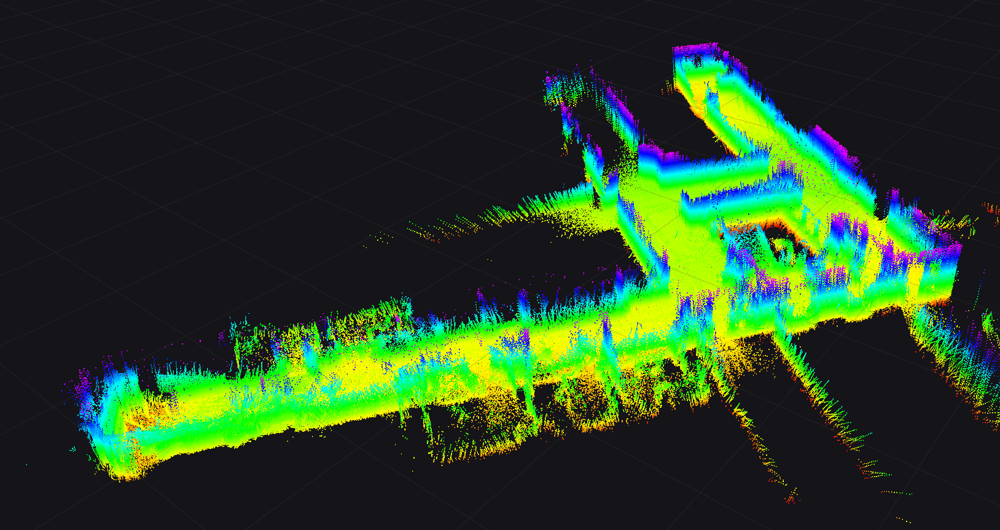
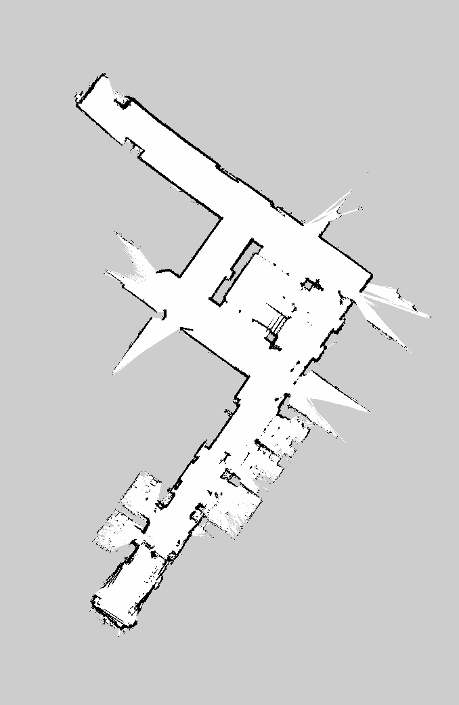

This repository contains an autonomous navigation stack for the [Unitree Go2 EDU](https://shop.unitree.com/products/unitree-go2) built on a **prior map**: you record the building once, then the robot localizes itself on that map and walks to any goal point you click. It uses only the built-in sensors — the L1 lidar and the IMU inside it. The system contains a mapping pipeline (Point-LIO odometry plus gravity alignment, with a MOLA loop-closure fallback), a localization module that matches the live scan against the prior map, and a Nav2-based planner with our own path follower. Everything runs on the Go2's onboard computer; the laptop only runs RViz. Requires the **Go2 EDU version** which has SDK support.

<p align="center">
  
</p>

## Requirements

Versions the system is developed and tested against. Anything marked *pinned* has to match, the rest is what happened to be installed and is unlikely to be fussy.

| | version | notes |
|---|---|---|
| Ubuntu | 22.04 LTS | on the laptop |
| ROS 2 | Humble Hawksbill | both laptop and robot |
| Python | 3.10 | system interpreter, **not** a conda one — see below |
| GCC / CMake | 11 / 3.22 | Ubuntu 22.04 defaults |
| Nav2 | 1.1.20 | `ros-humble-navigation2`, `ros-humble-nav2-bringup` |
| CycloneDDS RMW | 1.3.4 | `ros-humble-rmw-cyclonedds-cpp`, required by the Unitree topics |
| domain_bridge | — | `ros-humble-domain-bridge`, links the robot and laptop DDS domains |
| PCL | 1.12.1 | `libpcl-dev`, `ros-humble-perception-pcl` |
| Eigen | 3.4.0 | `libeigen3-dev` |
| NumPy | 1.26 | for the mapping scripts |
| SciPy | 1.10 | |
| Pillow | 12.3 | writes the 2D map previews |
| ffmpeg | 4.4 | only to remux camera recordings |

Needed for the loop-closure fallback only (§3 of Building a Map). MRPT and the MOLA packages are *pinned*: MOLA is built from source against the apt MRPT, and mismatched versions do not compile.

| | version |
|---|---|
| MRPT | 2.15.18 (apt, **hold it** — see Notes) |
| mola | 2.9.0 |
| mola_common | 0.6.1 |
| mp2p_icp | 2.10.3 |
| mola_lidar_odometry | 2.2.1 |
| mola_imu_preintegration | 1.16.1 |
| mola_state_estimation | 2.4.2 |
| mola_sm_loop_closure | 1.2.2 |

Python 3.10 means the interpreter at `/usr/bin/python3`. If conda or Isaac Sim is on your `PATH`, its Python will shadow the system one and the scripts will fail on `rclpy` and message typesupport. The `~/mola` launcher in the setup below exists precisely to avoid this — run every command in this README inside it.

## System Setup

### 1) On the Onboard Computer

The onboard computer needs ROS 2 Humble and the packages below. MOLA and MRPT are not needed here — the robot only localizes and navigates, it does not build maps.
```
sudo apt update
sudo apt install ros-humble-navigation2 ros-humble-nav2-bringup ros-humble-domain-bridge ros-humble-perception-pcl ros-humble-rmw-cyclonedds-cpp
```
Set up the Unitree DDS and Point-LIO by [following the CMU instructions](https://github.com/jizhang-cmu/autonomy_stack_go2) — this stack uses its `point_lio_unilidar` as the odometry front-end and its `go2_sport_api` to drive the legs. Our packages are built in a separate workspace at `~/go2_ws`, which the deploy script creates.

### 2) On the Laptop

Clone this repository and install the clean-shell launcher. The launcher is required: a normal shell that loads conda or Isaac Sim shadows `rosidl_generator_cpp` and breaks both colcon and rclpy.
```
git clone git@github.com:DmitriyB51/unitree-go2-edu.git ~/go2_mola_pipeline
cd ~/go2_mola_pipeline
cp env/mola ~/mola && chmod +x ~/mola
cp env/mola_bashrc ~/.mola_bashrc
```
Symlink the three packages into the MOLA workspace and compile. The repository is the source of truth; the workspace is only where colcon builds.
```
ln -s ~/go2_mola_pipeline/go2_localization ~/ros2_mola_ws/src/go2_localization
ln -s ~/go2_mola_pipeline/go2_navigation  ~/ros2_mola_ws/src/go2_navigation
ln -s ~/go2_mola_pipeline/plio2sm         ~/ros2_mola_ws/src/plio2sm
~/mola
cd ~/ros2_mola_ws && colcon build --symlink-install --cmake-args -DCMAKE_BUILD_TYPE=Release
```
Put the laptop and the robot on the same network — either the Ethernet port pointing backward (robot at 192.168.123.18) or a phone hotspot (robot at 172.20.10.3).

## Building a Map

### 1) Record

Stand the robot on the spot you want as the map origin. Start the recording, walk the robot through the building, stop it. Both Point-LIO and the bag run as detached systemd units, so an SSH drop will not kill them.
```
ssh unitree@192.168.123.18
bash ~/rt2x00_build/map_start.sh mymap
bash ~/rt2x00_build/map_stop.sh
```
**How you walk decides whether the recording is usable.** Point-LIO runs gyro-only on this lidar, so accumulated *rotation* slowly tilts its idea of "down", and only one constant tilt can be removed afterward. Walk closed loops so you never need a 180° turn; where a loop is impossible, walk the robot backwards instead of turning it around; turn slowly and never spin in place to look around. Walking speed and route length do not matter — rotation does.

Run the monitor in a second terminal while recording. It fits a plane to the trajectory in a sliding window and watches the tilt drift, so a doomed recording is flagged around minute 3 instead of after an hour of processing. It warns at 5° and tells you to re-record at 10°.
```
source ~/ros_env.sh && python3 ~/map_monitor.py
```
Copy the recording to the laptop.
```
scp -r unitree@192.168.123.18:~/maps/mymap ~/maps/
```

### 2) Build the Map Files

A map is **three files** built from one set of poses, so run these three commands in order, in the clean shell. Open it first and stay there.
```
~/mola
cd ~/go2_mola_pipeline
```

**a) The 3D map** — the point cloud the localization module matches against. This is also the step that removes the tilt, and it writes the corrected poses to `.tum` for the next two commands.
```
python3 scripts/gravity_align.py ~/maps/mymap ~/maps/mymap_gravity
```
Produces `~/maps/mymap_gravity.pcd` and `~/maps/mymap_gravity.tum`.

It prints the trajectory-plane residual when it finishes. **Under 20 cm means the whole "drift" was one rigid tilt, it has been removed, and your map is good — skip section 3 entirely.** On a clean recording this raw Point-LIO map is considerably better than anything the loop-closure pipeline produces (0.020 m versus 0.247 m of cross-pass cloud disagreement), so running MOLA on top would only make it worse. A residual of metres means the tilt was rotating during the walk; re-record if you can, or use the fallback in section 3.

<p align="center">
  
</p>

**b) The 2D map** — the occupancy grid Nav2 plans on. It is ray-traced from the corrected poses, not projected from the cloud, which is what makes the walls solid instead of dotted.
```
python3 go2_navigation/scripts/bag_to_grid.py ~/maps/mymap \
    go2_navigation/maps/building_mymap --poses-tum ~/maps/mymap_gravity.tum \
    --scan-stride 1 --skip-start 0 --min-range 0.2 --max-range 8 \
    --z-below 0.3 --z-above 0.8 --body-radius 0.8
```
Produces `building_mymap.pgm`, `building_mymap.yaml` and a `building_mymap_preview.png` you can open to check it by eye. It prints the wall / free / unknown percentages; for reference the deployed map is 1.95 % walls and 15.7 % free, with unbroken wall lines.

<p align="center">
  
</p>

**c) The localizability grid** — scores how much geometry the lidar can see at each spot, so the matcher knows where to distrust itself. Without it the matcher warns once and then trusts everything, including open areas where it should not.
```
python3 go2_localization/scripts/wall_density.py \
    --map ~/maps/mymap_gravity.pcd --traj ~/maps/mymap_gravity.tum \
    --out ~/maps/reloc_eval_report/wall_density_mymap
```
Produces `wall_density_mymap.locgrid`. It prints density percentiles along the trajectory — put those into `loc_lam_lo` / `loc_lam_hi` in `localization.yaml`, since the grid is tied to this map's point density and not just its frame.

Then point the configs at the new map. All three files belong to one map frame and must move together, or the planner and the localizer will disagree.
- `go2_localization/config/localization.yaml` → `map_path`, `localizability_map`
- `go2_navigation/launch/nav2_live.launch.py` → `default_map`

### 3) Loop Closure, Only If the Recording Drifted

If the plane residual came out in metres, the recording needs a global optimization instead of a single rotation. Convert the bag to an MRPT simplemap, close the loops manually (automatic loop detection does not work on this lidar), and export a dense cloud.
```
~/mola
ros2 run plio2sm plio2sm ~/maps/mymap ~/maps/mymap.simplemap 0.3 1.5
sm-cli export-keyframes ~/maps/mymap.simplemap --output ~/maps/mymap_kf.tum
python3 scripts/candidates.py ~/maps/mymap_kf.tum 2.5 40
```
Copy `pipelines/lc_manual.template.yaml`, fill in the timestamps of the places the robot genuinely revisited, then optimize and export.
```
env USE_KISS_MATCHER=true KISS_MATCHER_RESOLUTION=1.0 ASSUME_PLANAR_WORLD=true \
    PLANAR_WORLD_SIGMA_Z=0.05 PLANAR_WORLD_ANNEALING_ROUNDS=20 \
    MOLA_DESKEW_IGNORE_NO_TIMESTAMPS=true MAX_LC_CANDIDATES=0 \
  mola-sm-lc-cli -a mola::FrameToFrameLoopClosure \
    -p ~/maps/lc_manual.yaml -i ~/maps/mymap.simplemap -o ~/maps/mymap_lc.simplemap

sm2mm -i ~/maps/mymap_lc.simplemap -o ~/maps/mymap_lc.mm -p pipelines/sm2mm_dense.yaml
mm2ply -i ~/maps/mymap_lc.mm -o ~/maps/mymap_lc.ply && pcl_ply2pcd ~/maps/mymap_lc.ply ~/maps/mymap_lc.pcd
```
Feed the exported keyframes to `bag_to_grid.py --poses-tum` so the 2D grid ends up in the same geometry as the cloud.

## Deploying

One command pushes the packages, the dog-side scripts and the complete map set, rewrites the laptop paths to `/home/unitree`, verifies that every map file resolves on the robot, and rebuilds the workspace there.
```
./deploy/sync_to_dog.sh 192.168.123.18
```

## System Usage

Stand the robot on the map's origin — the spot where you started the recording — and keep it still for about 20 seconds while the IMU initializes, because Point-LIO captures its start frame at launch. Then open one SSH terminal per script and start them in this order.
```
~/run_pointlio.sh
~/run_matcher.sh
~/run_nav2.sh
~/run_nav_bridge.sh
```
On the laptop, launch RViz.
```
cd ~/go2_mola_pipeline && ./scripts/run_rviz_wifi.sh nav
```
The robot cannot move yet. That separation is deliberate: bring everything up, confirm in RViz that the live scan sits on top of the map walls, and only then start the bridge that drives the legs.
```
~/run_vel_ctrl.sh
```
If the robot's position in RViz is wrong, use the **'2D Pose Estimate'** button to place it correctly. Then use the **'Nav2 Goal'** button to set a goal point, and the robot will plan a route on the prior map and walk there. The goal arrow's direction is ignored — it drives to a point, not a pose. It takes one goal at a time, so to follow a route, set the next point once it arrives. Goals can also be published directly.
```
ros2 topic pub --once /goal_pose geometry_msgs/PoseStamped \
  '{header: {frame_id: map}, pose: {position: {x: 5.0, y: 2.0}, orientation: {w: 1.0}}}'
```

To watch the system's health while it runs, use the command below in another terminal. It prints a line per second with the localization fitness, the odometry distance, the scan rate and the CPU load.
```
~/run_health.sh
```
A fitness of 0.005–0.03 is a healthy lock. Above 0.1 the matcher has stopped trusting the map and is coasting on odometry. If fitness is bad while `dist_m` looks normal, the robot simply started from the wrong place — click '2D Pose Estimate'. If `dist_m` has grown to hundreds of metres, Point-LIO itself has diverged and must be restarted; a pose click will not help.

To replay a recording offline without the robot, use the launch files below. The matcher needs `/registered_scan`, which is not recorded because it starves Point-LIO, so only `loc_test_2_1_plio` can be replayed directly; for other bags reconstruct the topic with `~/maps/body2world.py` first.
```
~/mola
ros2 launch go2_localization offline_view.launch.py bag:=~/maps/loc_test_2_1_plio rate:=1.0
ros2 launch go2_navigation nav2_offline.launch.py
```

## Notes

- **There is no hardware emergency stop.** The factory remote does not override `/cmd_vel` — it commands the onboard sport controller in parallel with ours. The only stops are Ctrl+C on `run_vel_ctrl.sh`, which publishes `StopMove` on exit, and the node's 0.5 s `/cmd_vel` timeout, which stops the robot if Nav2 dies or WiFi drops. Never run goals unattended.

- Never run the CMU `system_real_robot.launch` alongside this stack. Its `pathFollower` publishes both `/cmd_vel` and `/api/sport/request`, which means two drivers fighting over the legs.

- The local costmap gives the controller a **stop, not an avoidance manoeuvre** — the planner does not see live obstacles, and nothing closer than 0.8 m is ever marked because the lidar sees the robot's own legs at that range.

- Never pin Point-LIO to specific cores or give it a realtime priority. Measured: a stationary robot's estimate starts orbiting about 5 m with a 25 s period.

- Standing still heats the rear hip motors until the firmware cuts torque and the robot collapses. Check with `~/motor_temp.sh`, which reports the differential against the coldest motors: under 10 °C is fine, over 25 °C means do not stand it up. Lay the robot down while you prepare.

- Sitting or lying the robot down mid-session diverges Point-LIO. Restart it afterwards.

- Recordings must contain only `/state_estimation`, `/cloud_registered_body` and `/utlidar/imu`. Adding `/registered_scan` and `/tf` starved Point-LIO and diverged the estimate by 2.5 km.

- Localization is solid among walls and unreliable in open areas and glass corridors. The lidar is sparse and the matcher tracks by scan registration, so its fitness measures local agreement rather than global correctness — the pose can be confidently wrong. The matcher trusts each match in proportion to its fitness and otherwise coasts on Point-LIO odometry until walls come back.

- There is no global relocalization: the robot must start on the map origin or be placed with '2D Pose Estimate'. ScanContext was implemented and tested and does not work on this sensor and building (recall@5 of 0.32).

- Never `apt install ros-humble-mrpt-apps-gui`. It pulls MRPT 3.0.4, which shadows the 2.15.18 headers and silently breaks every C++ rebuild with `mrpt/core/config.h: No such file`.

- `go2_localization` reads its map path from `install/`, so run colcon build after editing the config. With `--symlink-install`, editing an installed file takes effect immediately, but adding a new file still needs a rebuild.

- The L1's accelerometer is unusable and is zeroed by the CMU stack, leaving Point-LIO gyro-only. Most of the limitations above trace back to that. GLIM was evaluated as a replacement and rejected: a different SLAM framework cannot fix a weak sensor.

## Relevant Links

The odometry front-end is [Point-LIO](https://github.com/hku-mars/Point-LIO), packaged as [point_lio_unilidar](https://github.com/unitreerobotics/point_lio_unilidar) in the [CMU Go2 autonomy stack](https://github.com/jizhang-cmu/autonomy_stack_go2).

The loop-closure fallback uses [MOLA](https://github.com/MOLAorg/mola) and [MRPT](https://github.com/MRPT/mrpt).

The planner is [Nav2](https://github.com/ros-navigation/navigation2).
